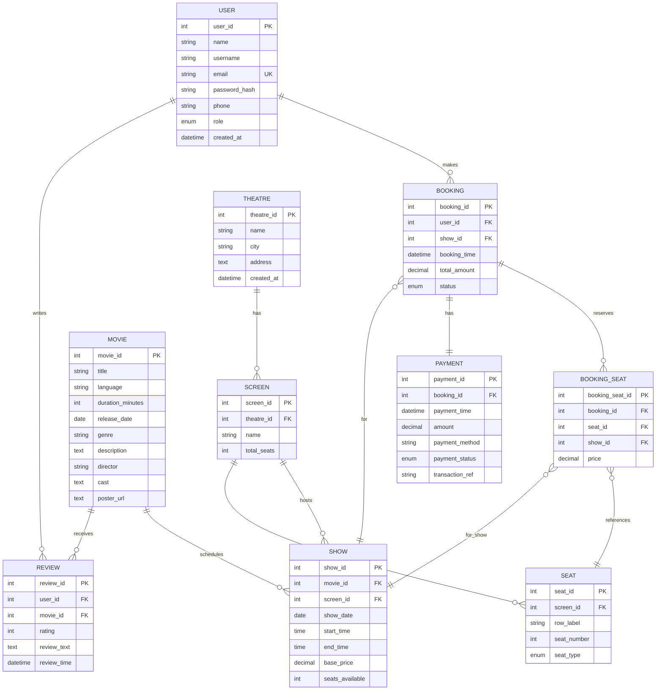

# Entity-Relationship Diagram

## Complete DBMS Schema for Movie Ticket Booking System



## Cardinality Explanations

### One-to-Many Relationships

1. **USER → BOOKING** (1:N)
   - One user can make multiple bookings
   - Each booking belongs to one user

2. **USER → REVIEW** (1:N)
   - One user can write multiple reviews (for different movies)
   - Each review is written by one user
   - **Constraint:** UNIQUE(user_id, movie_id) - one review per user per movie

3. **THEATRE → SCREEN** (1:N)
   - One theatre has multiple screens
   - Each screen belongs to one theatre

4. **SCREEN → SHOW** (1:N)
   - One screen hosts multiple shows (different times/movies)
   - Each show is in one screen

5. **SCREEN → SEAT** (1:N)
   - One screen has many seats (fixed layout)
   - Each seat belongs to one screen
   - **Constraint:** UNIQUE(screen_id, row_label, seat_number)

6. **MOVIE → SHOW** (1:N)
   - One movie has multiple shows (different theatres/times)
   - Each show plays one movie

7. **MOVIE → REVIEW** (1:N)
   - One movie receives multiple reviews
   - Each review is for one movie

8. **SHOW → BOOKING** (1:N)
   - One show has multiple bookings
   - Each booking is for one show

9. **BOOKING → BOOKING_SEAT** (1:N)
   - One booking reserves multiple seats
   - Each booking_seat belongs to one booking

### One-to-One Relationships

10. **BOOKING ← PAYMENT** (1:1)
    - Each booking has one payment record
    - Each payment is for one booking

### Many-to-Many (Resolved)

11. **SEAT ↔ BOOKING** (M:N via BOOKING_SEAT)
    - Many seats can be in many bookings (different shows)
    - Resolved through BOOKING_SEAT junction table
    - Includes price and show_id for context

12. **SHOW ↔ SEAT** (M:N via BOOKING_SEAT)
    - Shows which seats are booked for which shows
    - Junction table: BOOKING_SEAT

## Key Constraints

### Primary Keys
- All tables have AUTO_INCREMENT integer primary keys

### Foreign Keys
```sql
-- SCREENS
FOREIGN KEY (theatre_id) REFERENCES theatres(theatre_id) ON DELETE CASCADE

-- SHOWS
FOREIGN KEY (movie_id) REFERENCES movies(movie_id) ON DELETE CASCADE
FOREIGN KEY (screen_id) REFERENCES screens(screen_id) ON DELETE CASCADE

-- SEATS
FOREIGN KEY (screen_id) REFERENCES screens(screen_id) ON DELETE CASCADE

-- BOOKINGS
FOREIGN KEY (user_id) REFERENCES users(user_id)
FOREIGN KEY (show_id) REFERENCES shows(show_id)

-- BOOKING_SEATS
FOREIGN KEY (booking_id) REFERENCES bookings(booking_id) ON DELETE CASCADE
FOREIGN KEY (seat_id) REFERENCES seats(seat_id)
FOREIGN KEY (show_id) REFERENCES shows(show_id)

-- PAYMENTS
FOREIGN KEY (booking_id) REFERENCES bookings(booking_id) ON DELETE CASCADE

-- REVIEWS
FOREIGN KEY (user_id) REFERENCES users(user_id)
FOREIGN KEY (movie_id) REFERENCES movies(movie_id)
```

### Unique Constraints
1. `users.email` - No duplicate email addresses
2. `seats (screen_id, row_label, seat_number)` - No duplicate seats per screen
3. `reviews (user_id, movie_id)` - One review per user per movie
4. `booking_seats (booking_id, seat_id)` - No duplicate seats in same booking

### Check Constraints
1. `reviews.rating` - CHECK (rating BETWEEN 1 AND 5)
2. Application-level: seat availability validation

## Data Flow Examples

### Booking Flow
```
1. User selects SHOW (movie + screen + theatre + time)
   ↓
2. System fetches SEATS for that SCREEN
   ↓
3. System checks BOOKING_SEATS for occupied seats in that SHOW
   ↓
4. User selects available SEATS
   ↓
5. Create BOOKING (user + show + total amount)
   ↓
6. Create BOOKING_SEAT entries (link booking to seats)
   ↓
7. Create PAYMENT record
   ↓
8. Update SHOW.seats_available (decrement)
```

### Review Flow
```
1. User views MOVIE details
   ↓
2. System fetches existing REVIEWS for that MOVIE
   ↓
3. User submits rating + text
   ↓
4. System validates UNIQUE(user_id, movie_id)
   ↓
5. Create REVIEW record
   ↓
6. Recalculate average rating for MOVIE
```

### Show Availability Query
```
1. JOIN SHOWS with SCREENS
   ↓
2. JOIN SCREENS with THEATRES
   ↓
3. JOIN SHOWS with MOVIES
   ↓
4. Filter by city/date
   ↓
5. Return shows with theatre and movie details
```

## Normalization Summary

### 1NF ✅
- All attributes are atomic
- No repeating groups
- Each table has primary key

### 2NF ✅
- All 1NF requirements met
- No partial dependencies
- All non-key attributes fully depend on primary key

### 3NF ✅
- All 2NF requirements met
- No transitive dependencies
- Exception: `shows.seats_available` denormalized for performance

## Implementation Files

- **Schema Definition:** `src/services/database.js` (Lines 7-175)
- **Relationships:** Maintained through service layer methods
- **Constraints:** Enforced in service validation logic
- **Queries:** Implemented in service functions with proper joins

---

**Diagram Tools:**
- Copy the Mermaid code above into any Mermaid editor
- Recommended: [Mermaid Live Editor](https://mermaid.live/)
- Or use VS Code Mermaid plugin
